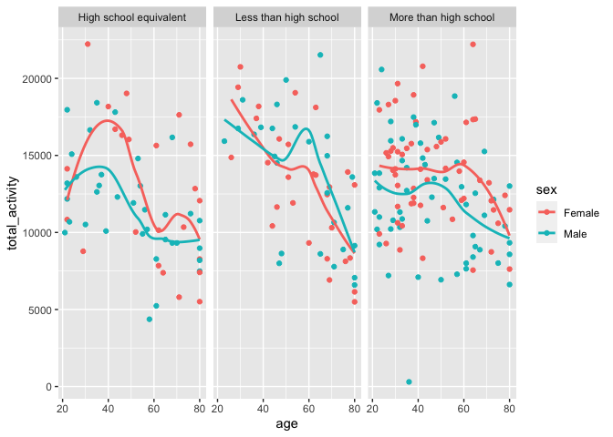
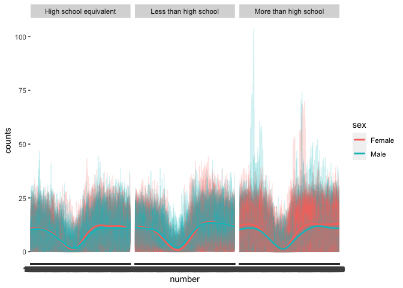

P8105_hw3_jl6648
================
Jixin Li
2023-10-09

# probelm 2

``` r
library(tidyverse)
library(dplyr)
library(p8105.datasets)                                                                  # load the data
data("brfss_smart2010") 
```

``` r
brfss_df =
  brfss_smart2010 |>
  janitor::clean_names() |>
  filter(topic == "Overall Health") |>
  separate(locationdesc, into = c("state", "county"), sep = " - ") |>
  filter(response == "Excellent" | response == "Very good" | response == "Good" | 
         response == "Fair" | response == "Poor") |>
  mutate(response = as.factor(response),
         response = ordered(response, levels = c("Excellent", "Very good", "Good", "Fair", "Poor"))) 
```

## question 1

In 2002, which states were observed at 7 or more locations? What about
in 2010?

``` r
prob1_q1_02 = filter(brfss_df, year == 2002) |>
  group_by(state) |>
  summarize(n_obs = n_distinct(county)) |>
  filter(n_obs >= 7) 

state_2002 = pull(prob1_q1_02, state)
```

In 2002, following states CT, FL, MA, NC, NJ, PA were observed at 7 or
more location

``` r
prob1_q1_10 = filter(brfss_df, year == 2010) |>
  group_by(state) |>
  summarize(n_obs = n_distinct(county)) |>
  filter(n_obs >= 7) 

state_2010 = pull(prob1_q1_10, state)
```

In 2010, following states CA, CO, FL, MA, MD, NC, NE, NJ, NY, OH, PA,
SC, TX, WA were observed at 7 or more location

## question 2

``` r
brfss_excellent =
brfss_df |>
  filter(response == "Excellent") |>
  select(year, state, county, response, data_value) |>
  group_by(year, state)

brfss_excellent |>
ggplot(aes(x = year, y = data_value)) +
  geom_line(aes(color = state)) +
  labs(
    title = "average value over time within a state",
    x = "Year",
    y = "average value",
    caption = "Data from the p8105.datasets package"
  ) 
```

<!-- -->

## question 3

``` r
brfss_NY =
  brfss_df |> 
  filter(state == "NY") |>
  filter(year == 2006 | year == 2010) |>
  select(year, state, county, response, data_value) |>
  group_by(year, state)

brfss_NY |>
ggplot(aes(x = year, y = data_value)) +
  geom_line(aes(color = county)) +
  labs(
    title = "average value among locations in NY states in 2006 and 2010",
    x = "Year",
    y = "average value",
    caption = "Data from the p8105.datasets package"
  ) 
```

<!-- -->

# problem 3

``` r
covar_df =
  read_csv("nhanes_covar.csv") |>
  janitor::clean_names() |>
  filter(age >= 21) |>
   mutate(                                  
    sex = replace(sex, sex == 2, "Female"),
    sex = replace(sex, sex == 1, "Male"),
    education = replace(education, education == 1, "Less than high school"),
    education = replace(education, education == 2, "High school equivalent"),
    education = replace(education, education == 3, "More than high school")
   ) |>
  mutate(sex = as.factor(sex),
         education = as.factor(education)
  )
```

    ## Rows: 250 Columns: 5
    ## ── Column specification ────────────────────────────────────────────────────────
    ## Delimiter: ","
    ## dbl (5): SEQN, sex, age, BMI, education
    ## 
    ## ℹ Use `spec()` to retrieve the full column specification for this data.
    ## ℹ Specify the column types or set `show_col_types = FALSE` to quiet this message.

``` r
accel_df =
  read_csv("nhanes_accel.csv") |>
  janitor::clean_names()
```

    ## Rows: 250 Columns: 1441
    ## ── Column specification ────────────────────────────────────────────────────────
    ## Delimiter: ","
    ## dbl (1441): SEQN, min1, min2, min3, min4, min5, min6, min7, min8, min9, min1...
    ## 
    ## ℹ Use `spec()` to retrieve the full column specification for this data.
    ## ℹ Specify the column types or set `show_col_types = FALSE` to quiet this message.

``` r
combine_df =
  inner_join(covar_df, accel_df, by = "seqn")
```

### Produce a reader-friendly table for the number of men and women in each education category

``` r
sex_education_table =
  select(combine_df, sex | education) 
  
table(sex_education_table)
```

    ##         education
    ## sex      High school equivalent Less than high school More than high school
    ##   Female                     23                    29                    59
    ##   Male                       36                    28                    56

### create a visualization of the age distributions for men and women in each education category

``` r
agedistri_edu =
  select(combine_df, sex | education | age) 

ggplot(agedistri_edu) +
  geom_boxplot(aes(x = education, y = age, color = sex)) +
  labs(
    title = "age distributions for men and women in each education category",
    x = "category of education",
    y = "age",
  )
```

<!-- -->

### Plot these total activities (y-axis) against age (x-axis)

``` r
accel_clean = 
  combine_df |>
  pivot_longer(
    min1:min1440,
    names_to = "number",
    values_to = "counts",
    names_prefix = "min"
  )

accel_clean |>
ggplot(aes(x = age, y = counts)) +
  geom_smooth(aes(color = sex)) +
  facet_grid(. ~ education)
```

    ## `geom_smooth()` using method = 'gam' and formula = 'y ~ s(x, bs = "cs")'

<!-- -->

``` r
  labs(
    title = "total activities against age",
    x = "age",
    y = "total activities",
  ) 
```

    ## $x
    ## [1] "age"
    ## 
    ## $y
    ## [1] "total activities"
    ## 
    ## $title
    ## [1] "total activities against age"
    ## 
    ## attr(,"class")
    ## [1] "labels"

### Make a three-panel plot that shows the 24-hour activity time courses for each education level and use color to indicate sex.

``` r
accel_clean |>
ggplot(aes(x = number, y = counts)) +
  geom_line(aes(color = sex)) +
  facet_grid(. ~ education) +
  labs(
    title = "total activities over 24-hour",
    x = "time(mins)",
    y = "total activities",
  ) 
```

<!-- -->
