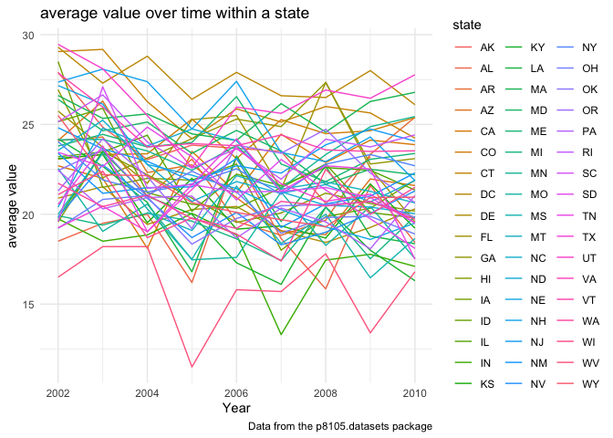
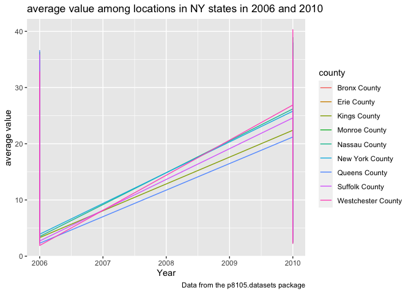

P8105_hw3_jl6648
================
Jixin Li
2023-10-09

# probelm 2

``` r
library(tidyverse)
library(dplyr)
library(p8105.datasets)                                                                  # load the data
data("brfss_smart2010") 
```

``` r
brfss_df =
  brfss_smart2010 |>
  janitor::clean_names() |>
  filter(topic == "Overall Health") |>
  separate(locationdesc, into = c("state", "county"), sep = " - ") |>
  filter(response == "Excellent" | response == "Very good" | response == "Good" | 
         response == "Fair" | response == "Poor") |>
  mutate(response = as.factor(response),
         response = ordered(response, levels = c("Excellent", "Very good", "Good", "Fair", "Poor"))) 
```

## question 1

In 2002, which states were observed at 7 or more locations? What about
in 2010?

``` r
prob1_q1_02 = filter(brfss_df, year == 2002) |>
  group_by(state) |>
  summarize(n_obs = n_distinct(county)) |>
  filter(n_obs >= 7) 

state_2002 = pull(prob1_q1_02, state)
```

In 2002, following states CT, FL, MA, NC, NJ, PA were observed at 7 or
more location

``` r
prob1_q1_10 = filter(brfss_df, year == 2010) |>
  group_by(state) |>
  summarize(n_obs = n_distinct(county)) |>
  filter(n_obs >= 7) 

state_2010 = pull(prob1_q1_10, state)
```

In 2010, following states CA, CO, FL, MA, MD, NC, NE, NJ, NY, OH, PA,
SC, TX, WA were observed at 7 or more location

## question 2

``` r
brfss_excellent =
brfss_df |>
  filter(response == "Excellent") |>
  select(year, state, county, response, data_value) |>
  group_by(year, state)

brfss_excellent |>
ggplot(aes(x = year, y = data_value)) +
  geom_line(aes(color = state)) +
  labs(
    title = "average value over time within a state",
    x = "Year",
    y = "average value",
    caption = "Data from the p8105.datasets package"
  ) 
```

<!-- -->

## question 3

``` r
brfss_NY =
  brfss_df |> 
  filter(state == "NY") |>
  filter(year == 2006 | year == 2010) |>
  select(year, state, county, response, data_value) |>
  group_by(year, state)

brfss_NY |>
ggplot(aes(x = year, y = data_value)) +
  geom_line(aes(color = county)) +
  labs(
    title = "average value among locations in NY states in 2006 and 2010",
    x = "Year",
    y = "average value",
    caption = "Data from the p8105.datasets package"
  ) 
```

<!-- -->
