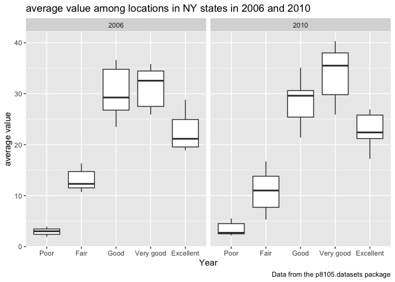

P8105_hw3_jl6648
================
Jixin Li
2023-10-09

# problem 1

#### Read in the data

``` r
library(tidyverse)
```

    ## ── Attaching core tidyverse packages ──────────────────────── tidyverse 2.0.0 ──
    ## ✔ dplyr     1.1.3     ✔ readr     2.1.4
    ## ✔ forcats   1.0.0     ✔ stringr   1.5.0
    ## ✔ ggplot2   3.4.3     ✔ tibble    3.2.1
    ## ✔ lubridate 1.9.2     ✔ tidyr     1.3.0
    ## ✔ purrr     1.0.2     
    ## ── Conflicts ────────────────────────────────────────── tidyverse_conflicts() ──
    ## ✖ dplyr::filter() masks stats::filter()
    ## ✖ dplyr::lag()    masks stats::lag()
    ## ℹ Use the conflicted package (<http://conflicted.r-lib.org/>) to force all conflicts to become errors

``` r
library(dplyr)
data("instacart")
```

    ## Warning in data("instacart"): data set 'instacart' not found

``` r
library(p8105.datasets) 

instacart = 
  instacart |> 
  as_tibble()
```

#### Answer questions about the data

This dataset contains 1384617 rows and 15 columns, with each row
resprenting a single product from an instacart order. Variables include
identifiers for user, order, and product; the order in which each
product was added to the cart. There are several order-level variables,
describing the day and time of the order, and number of days since prior
order. Then there are several item-specific variables, describing the
product name (e.g. Yogurt, Avocado), department (e.g. dairy and eggs,
produce), and aisle (e.g. yogurt, fresh fruits), and whether the item
has been ordered by this user in the past. In total, there are 39123
products found in 131209 orders from 131209 distinct users.

Below is a table summarizing the number of items ordered from aisle. In
total, there are 134 aisles, with fresh vegetables and fresh fruits
holding the most items ordered by far.

``` r
instacart |> 
  count(aisle) |> 
  arrange(desc(n))
```

    ## # A tibble: 134 × 2
    ##    aisle                              n
    ##    <chr>                          <int>
    ##  1 fresh vegetables              150609
    ##  2 fresh fruits                  150473
    ##  3 packaged vegetables fruits     78493
    ##  4 yogurt                         55240
    ##  5 packaged cheese                41699
    ##  6 water seltzer sparkling water  36617
    ##  7 milk                           32644
    ##  8 chips pretzels                 31269
    ##  9 soy lactosefree                26240
    ## 10 bread                          23635
    ## # ℹ 124 more rows

Next is a plot that shows the number of items ordered in each aisle.
Here, aisles are ordered by ascending number of items.

``` r
instacart |> 
  count(aisle) |> 
  filter(n > 10000) |> 
  mutate(aisle = fct_reorder(aisle, n)) |> 
  ggplot(aes(x = aisle, y = n)) + 
  geom_point() + 
  labs(title = "Number of items ordered in each aisle") +
  theme(axis.text.x = element_text(angle = 60, hjust = 1))
```

<!-- -->

Our next table shows the three most popular items in aisles
`baking ingredients`, `dog food care`, and `packaged vegetables fruits`,
and includes the number of times each item is ordered in your table.

``` r
instacart |> 
  filter(aisle %in% c("baking ingredients", "dog food care", "packaged vegetables fruits")) |>
  group_by(aisle) |> 
  count(product_name) |> 
  mutate(rank = min_rank(desc(n))) |> 
  filter(rank < 4) |> 
  arrange(desc(n)) |>
  knitr::kable()
```

| aisle                      | product_name                                  |    n | rank |
|:---------------------------|:----------------------------------------------|-----:|-----:|
| packaged vegetables fruits | Organic Baby Spinach                          | 9784 |    1 |
| packaged vegetables fruits | Organic Raspberries                           | 5546 |    2 |
| packaged vegetables fruits | Organic Blueberries                           | 4966 |    3 |
| baking ingredients         | Light Brown Sugar                             |  499 |    1 |
| baking ingredients         | Pure Baking Soda                              |  387 |    2 |
| baking ingredients         | Cane Sugar                                    |  336 |    3 |
| dog food care              | Snack Sticks Chicken & Rice Recipe Dog Treats |   30 |    1 |
| dog food care              | Organix Chicken & Brown Rice Recipe           |   28 |    2 |
| dog food care              | Small Dog Biscuits                            |   26 |    3 |

Finally is a table showing the mean hour of the day at which Pink Lady
Apples and Coffee Ice Cream are ordered on each day of the week. This
table has been formatted in an untidy manner for human readers. Pink
Lady Apples are generally purchased slightly earlier in the day than
Coffee Ice Cream, with the exception of day 5.

``` r
instacart |>
  filter(product_name %in% c("Pink Lady Apples", "Coffee Ice Cream")) |>
  group_by(product_name, order_dow) |>
  summarize(mean_hour = mean(order_hour_of_day)) |>
  pivot_wider(
    names_from = order_dow, 
    values_from = mean_hour) |>
  knitr::kable(digits = 2)
```

    ## `summarise()` has grouped output by 'product_name'. You can override using the
    ## `.groups` argument.

| product_name     |     0 |     1 |     2 |     3 |     4 |     5 |     6 |
|:-----------------|------:|------:|------:|------:|------:|------:|------:|
| Coffee Ice Cream | 13.77 | 14.32 | 15.38 | 15.32 | 15.22 | 12.26 | 13.83 |
| Pink Lady Apples | 13.44 | 11.36 | 11.70 | 14.25 | 11.55 | 12.78 | 11.94 |

# probelm 2

``` r
library(tidyverse)
library(dplyr)
library(p8105.datasets)                                                             # load the data
data("brfss_smart2010") 
```

``` r
brfss_df =
  brfss_smart2010 |>                                                                     #load dataset
  janitor::clean_names() |>                                                     # clean variable names
  filter(topic == "Overall Health") |>                                   #select interested variable  
  separate(locationdesc, into = c("state", "county"), sep = " - ") |>     #separate into two variables
  filter(response == "Excellent" | response == "Very good" | response == "Good" | 
         response == "Fair" | response == "Poor") |>                       #select interested response
  mutate(response = as.factor(response),            #organize responses as a factor taking levels order
         response = ordered(response, levels = c("Excellent", "Very good", "Good", "Fair", "Poor"))) 
```

## question 1

In 2002, which states were observed at 7 or more locations? What about
in 2010?

``` r
prob1_q1_02 = filter(brfss_df, year == 2002) |>                           # select rows with year 2002
  group_by(state) |>                                                             # group data by state
  summarize(n_obs = n_distinct(county)) |>       #sum the number of different county within each state
  filter(n_obs >= 7)                                              # filter county larger or equal to 7

state_2002 = pull(prob1_q1_02, state)                                               # show these states
```

In 2002, following states CT, FL, MA, NC, NJ, PA were observed at 7 or
more location

``` r
prob1_q1_10 = filter(brfss_df, year == 2010) |>                            # select rows with year 2010
  group_by(state) |>                                                              # group data by state
  summarize(n_obs = n_distinct(county)) |>        #sum the number of different county within each state
  filter(n_obs >= 7)                                               # filter county larger or equal to 7

state_2010 = pull(prob1_q1_10, state)                                               # show these states
```

In 2010, following states CA, CO, FL, MA, MD, NC, NE, NJ, NY, OH, PA,
SC, TX, WA were observed at 7 or more location

## question 2

``` r
brfss_excellent =
brfss_df |>
  filter(response == "Excellent") |>                                  #filter only Excellent responses 
  group_by(year, state) |>                                               #group date by year and state
  summarise(avg_data = mean(data_value, na.rm = T))  
                                               #add variable to take average of data_value with a state

#make a plot to show the average value over time within a state, use lab to lable the graph
brfss_excellent |>
ggplot(aes(x = year, y = avg_data, color = state)) +     
  geom_line() +
  labs(
    title = "average value over time within a state",
    x = "Year",
    y = "average value",
    caption = "Data from the p8105.datasets package"
  ) +
  theme_minimal()                                                     # make the background looks clear
```

<!-- -->

## question 3

``` r
brfss_NY =
  brfss_df |>                                                                        # load the dataset
  filter(state == "NY") |>                                                            # select NY state
  filter(year == 2006 | year == 2010) |>                                    # select year 2006 and 2010
  select(year, state, county, response, data_value) |>                    # select interested variables
  group_by(year, state)                                               # group dataset by year and state

# make a plot to show distribution of data_value for responses (“Poor” to “Excellent”) among locations in NY State, use lab to lable the graph
brfss_NY |>
ggplot(aes(x = response, y = data_value)) +
  geom_boxplot() +  
  facet_wrap(~ year, ncol = 2) +
  labs(
    title = "average value among locations in NY states in 2006 and 2010",
    x = "Year",
    y = "average value",
    caption = "Data from the p8105.datasets package"
  ) 
```

<!-- -->

# problem 3

``` r
covar_df =
  read_csv("nhanes_covar.csv", skip = 4) |>                                         # read the dataset
  janitor::clean_names() |>                                                     # clean variable names
  filter(age >= 21) |>                                                        # remove people under 21
   mutate(             # mutate sex and education variable to show character instead of numeric number
    sex = replace(sex, sex == 2, "Female"),
    sex = replace(sex, sex == 1, "Male"),
    education = replace(education, education == 1, "Less than high school"),
    education = replace(education, education == 2, "High school equivalent"),
    education = replace(education, education == 3, "More than high school")
   ) |>
  mutate(sex = as.factor(sex),                           # mutate sex and education as factor variable 
         education = as.factor(education)
  ) |>
  na.omit()                                                               # remove any na from the data
```

``` r
accel_df =
  read_csv("nhanes_accel.csv") |>                                                       # read dataset
  janitor::clean_names() |>                                                     # clean variable names 
  pivot_longer(                                             # make the dataset longer instead of wider 
    min1:min1440,
    names_to = "number",
    values_to = "counts",
    names_prefix = "min"
  )
```

``` r
combine_df =
  left_join(covar_df, accel_df, by = "seqn")                                 # join these two dataset
```

### Produce a reader-friendly table for the number of men and women in each education category

``` r
sex_education_table =
  select(covar_df, sex | education)           # select interested variable including sex and educaiton
  
table(sex_education_table)                                                            # show the table 
```

    ##         education
    ## sex      High school equivalent Less than high school More than high school
    ##   Female                     23                    28                    59
    ##   Male                       35                    27                    56

at the High school equivalent education level, the number of males is
larger than the number of females; at less the high school and more than
high school education level, the number of females is larger than the
number of males. For the total number of people in each education level,
more than high school contains the largest number of people, high school
equivalent contains 2nd largest number of people, and less than high
school contains the least number of people.

### create a visualization of the age distributions for men and women in each education category

``` r
# plot a graph to show the age distributions for men and women in each education category, group people by their education level and gender. use lab to label the graph

covar_df |>
ggplot(aes(x = age, fill = sex )) +
  geom_density(alpha = .5) +
  facet_grid(. ~ education)
```

<!-- -->

``` r
  labs(
    title = "age distributions for men and women in each education category",
    x = "age",
    y = "density",
  ) +
  theme_minimal()
```

    ## NULL

according to the graph: as age increase, the number of females exceed
the number of males at high school equivalent and less than high school
education level. At the young and mid age, the number of females exceed
the number of males only at more than high school education level. It
indicates, more and more young females receive higher level education
compared with people of last generations. Younger generation tend to
have higher education level compared with mid to old age generation.

### Plot these total activities (y-axis) against age (x-axis)

``` r
accel_clean = 
  combine_df |>                                                                         # load dataset 
  group_by(seqn, sex, age, education) |>                          # group data by interested variables
  summarize(
    total_activity = sum(counts)                                   # sum total activities for each seqn
  )

# plot a graph to show the relationship between total activities and age for each participants. group people by sex and education level as well. use lab to lable the graph
accel_clean |>
ggplot(aes(x = age, y = total_activity, color = sex)) +
  geom_point() +
  geom_smooth(se = FALSE) +
  facet_grid(. ~ education)
```

<!-- -->

``` r
  labs(
    title = "total activities against age",
    x = "age",
    y = "total activities",
  ) 
```

    ## $x
    ## [1] "age"
    ## 
    ## $y
    ## [1] "total activities"
    ## 
    ## $title
    ## [1] "total activities against age"
    ## 
    ## attr(,"class")
    ## [1] "labels"

at high school equivalent and more than high school education level,
overall females activity is higher than males. at less than high school
education level, the overall males activity is higher than females. No
matter education level and gender, total activity decreases as the age
increases.

### Make a three-panel plot that shows the 24-hour activity time courses for each education level and use color to indicate sex.

``` r
# plot a graph to show the relationship between 24-hour activity time courses for each participants. group people by sex and education level as well. use lab to lable the graph

combine_df |>
ggplot(aes(x = number, y = counts, group = seqn, color = sex)) +
  geom_line(alpha = .2) +
  facet_grid(. ~ education) +
  geom_smooth(aes(group = sex), se = FALSE)
```

<!-- -->

``` r
  labs(
    title = "total activities over 24-hour",
    x = "time(mins)",
    y = "total activities",
  ) 
```

    ## $x
    ## [1] "time(mins)"
    ## 
    ## $y
    ## [1] "total activities"
    ## 
    ## $title
    ## [1] "total activities over 24-hour"
    ## 
    ## attr(,"class")
    ## [1] "labels"

No matter gender and education level, the pattern of 24 hour activity is
similar. at high school equivalent and less than high school education
level, 24 hour activity of male is higher than female; at more than high
school education level, 24 hour activity of female is higher than male.
